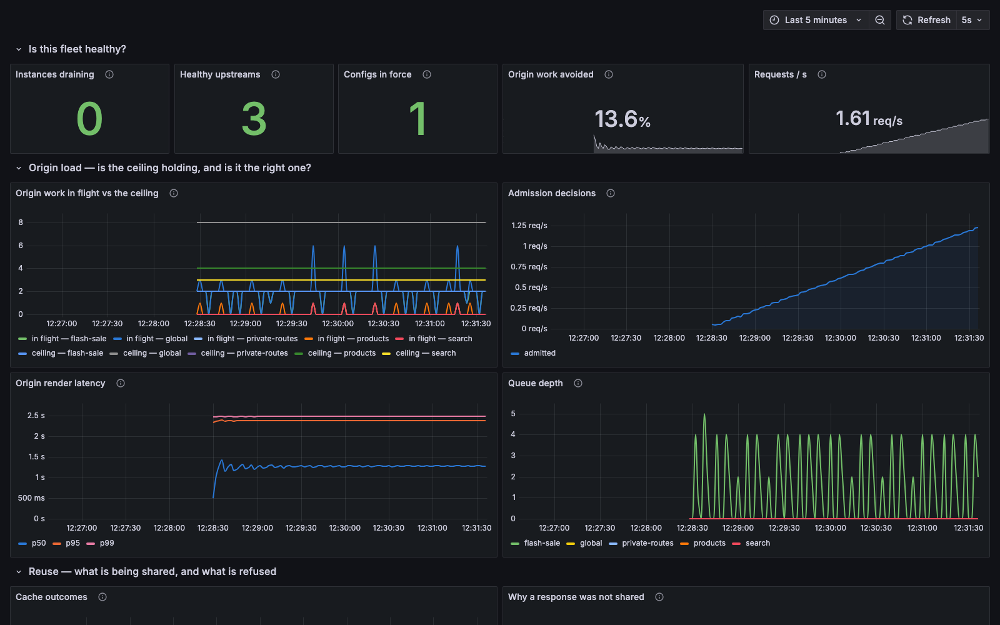

# Tanod

**Stop traffic spikes from becoming render spikes.**

Rust reverse proxy and origin workload governor for self-hosted Next.js:
bounded render concurrency, request coalescing, safe microcaching, bounded
queues and load shedding. Built on Pingora.

> [!CAUTION]
> **Tanod is under active development and remains pre-1.0.** Version 0.1.2 is
> running and externally load-tested in a controlled DigitalOcean
> staging deployment, but it has not been validated under sustained production
> traffic or independently security-audited. APIs, configuration, behavior and
> operational guarantees may change without notice.

A scraper walks ten thousand product URLs on your storefront. Every URL is
distinct, so the cache has nothing to serve and there are no duplicate requests
to collapse. Each one is a full React render, a database round trip and a CMS
call. The rate limiter sees an unremarkable arrival rate and lets them through.
The autoscaler reacts thirty seconds later, by which point the origin is already
failing.

Nothing in that path was misconfigured. The defenses simply had no way to see
what those requests cost, because **every conventional defense counts requests,
and server rendering made requests stop being a unit of work.** One route is a
cached shell; the next fans out into a React render, a database round trip, a
CMS call and a pricing service. Rate limiting, connection limits and autoscaling
triggers all count requests, so none of them can tell those two apart.

Tanod counts the work instead. It is an open-source Rust reverse proxy that
bounds how much *rendering* may reach an origin at once, rather than how many
requests arrive. The ordering is the point: cache hits and duplicate requests
are reused **first**, and only genuine cache misses enter per-route and global
admission control, so reuse never spends origin capacity. Whatever the origin
still cannot absorb meets a bounded queue, a deadline, and a defined answer —
stale content or a shed request — instead of an unbounded pile of concurrent
renders.

Tanod is built on [Pingora](https://github.com/cloudflare/pingora), the Rust
proxy framework Cloudflare wrote to replace its NGINX fleet. Cloudflare reports
that Pingora has served more than 40 million Internet requests per second for
years. The parts of a reverse proxy that are
unglamorous and easy to get subtly wrong — connection pooling, HTTP/1 and
HTTP/2 handling, graceful restarts, timeouts, the cache lock — are inherited
from that codebase, and Tanod now exercises that surface end to end: HTTP/1.1
and HTTP/2 in both directions, TLS in both directions, `Upgrade` tunnelling,
`Range` and conditional requests. What Tanod adds on top is the governor:
classification, cache-key and shareability rules, and bounded origin admission.

> A *tanod* (Tagalog) is the barangay watchman: the one posted at the gate to
> keep order, so the community is never overrun.

## Project maturity and expectations

**Treat it as a working prototype with a serious test suite.** There is a
[threat model](./docs/THREAT-MODEL.md), an
[adversarial suite](./bench/adversarial.sh) in CI, and a
[soak](./bench/soak.sh), [memory-pressure](./bench/memory.sh),
[restart](./bench/upgrade.sh) and [chaos](./bench/chaos.sh) test that assert
rather than report — and have found real bugs. All of it is synthetic load
against a local fixture origin.

Reference documentation:

| | |
|---|---|
| [`docs/OPERATIONS.md`](./docs/OPERATIONS.md) | Running it: readiness, drain, restart, systemd, Kubernetes, what to alert on |
| [`docs/STANDALONE.md`](./docs/STANDALONE.md) | Installing one binary on a server and connecting a domain |
| [`docs/CONFIG-SCHEMA.md`](./docs/CONFIG-SCHEMA.md) | Schema versioning, what may change without a bump, migration notes |
| [`docs/RELEASE-GATES.md`](./docs/RELEASE-GATES.md) | What has to pass before a tag, and what is deliberately not gated |
| [`docs/THREAT-MODEL.md`](./docs/THREAT-MODEL.md) | What is protected, from whom, and what is not defended |
| [`docs/CACHE-KEY-REVIEW.md`](./docs/CACHE-KEY-REVIEW.md) | A brief for the independent review that has not yet happened |
| [`docs/ROADMAP.md`](./docs/ROADMAP.md) | Active work, current limitations, and framework expansion plans |
| [`ops/`](./ops) | Example Prometheus alerts and a Grafana dashboard |
| [`CHANGELOG.md`](./CHANGELOG.md) | What changed in each release, and what to do when upgrading |

Except for the bounded staging A/B result reported below, everything described
as a benefit is a **design goal supported by local tests**, not an outcome
observed under sustained production traffic. If you deploy it, do so behind
something you can fail back to, and read
[Slow readers and render capacity](#slow-readers-and-render-capacity) and
[the roadmap and current limitations](./docs/ROADMAP.md) for the parts that are
known to be incomplete.

## Contents

**Using it**
[Quick start](#quick-start) ·
[Installation](#installation) ·
[Using Tanod with Next.js](#using-tanod-with-nextjs) ·
[Configuration](#configuration) ·
[Operating Tanod](#operating-tanod)

**Understanding it**
[The problem](#the-problem) ·
[Is Tanod for you?](#is-tanod-for-you) ·
[What Tanod does](#what-tanod-does) ·
[Benchmarks](#benchmarks) ·
[Design and internals](#design-and-internals)

**Where it stands**
[Project maturity](#project-maturity-and-expectations) ·
[Project status](#project-status) ·
[Roadmap and limitations](./docs/ROADMAP.md) ·
[Security](#security)

## The problem

A server-rendered request is not a cheap request. One hit on a Next.js route can
fan out into React rendering, a database round trip, a CMS call, a pricing
service and a recommendations service. Ten thousand requests can become ten
thousand of each.

React Server Components sharpen this. The same URL returns a full HTML render
or an RSC flight payload depending on a request header, and a prefetch costs
something different again — so the cost of a request is not merely high, it is
invisible from the URL. Anything counting requests is counting a unit that no
longer means anything.

That matters because SSR origins fail non-linearly. A Node process serving a
200 ms render comfortably at 50 concurrent requests does not serve 500 concurrent
requests ten times slower — it starts queueing inside the event loop, latency
climbs faster than load, health checks begin timing out, the orchestrator
restarts pods, and the surviving pods inherit the traffic that killed the last
ones.

Conventional protection is a poor fit for this shape:

- **Request-per-second rate limiting** counts requests, not work. A cheap static
  asset and an expensive product page cost the same against the limit.
- **A reverse-proxy cache** helps only where responses are cacheable. Next.js
  [documents dynamically rendered pages](https://nextjs.org/docs/app/guides/self-hosting#automatic-caching)
  as private and non-cacheable, so a conventional shared cache skips precisely
  the traffic that hurts.
- **Autoscaling** reacts on the order of tens of seconds. A traffic spike arrives
  in one.

### The case nothing else covers

Caching and request collapsing are the two mechanisms usually reached for, and
both depend on requests repeating. A burst on one popular URL is the easy
shape: one render serves all of it.

The hard shape is the opposite one. An automated client walking thousands of
distinct URLs produces sustained origin concurrency in which **every request is
a unique cache miss and nothing can be collapsed.** A cache contributes
nothing. Coalescing contributes nothing. The work arrives an order of magnitude
faster than an autoscaler responds, and it does not stop when the burst does,
because there is no burst — just a client that keeps walking. Bounding how much
of that may reach the origin at once is the only mechanism left.

Blocking the client is the first thing to try, and Tanod is not the tool for
it: it does not rate-limit by client, address or request rate, and a public
deployment should still have an edge component in front that does. But some of
this traffic is legitimate, some is distributed across enough addresses to
survive per-client limits, and some of it simply gets through. Admission
control decides what happens to the share that does — whether it degrades the
origin, or queues behind a ceiling and receives a defined answer.

### Why Tanod exists

Because the useful unit to bound is *origin work*, not requests, and few
off-the-shelf proxy configurations combine per-route work limits, a bounded
queue, a deadline, reuse-before-admission and a defined overload response.

Request collapsing is old news — Varnish, `proxy_cache_lock`, Fastly and Apache
Traffic Server have done it for years. Tanod's argument is the other half:
duplicate work is reused *first*, and whatever genuinely has to reach the origin
then passes through admission control that can say no.

#### Scope: Next.js today, framework-agnostic by design

Tanod's policy contract — routes, work classes, cache keys, shareability
rules — does not assume a framework. Next.js is the first and only supported
adapter because that is where the traffic is, not because the design depends on
it. The Next-specific surface is request classification: the `RSC`,
`Next-Router-Prefetch` and `Next-Action` headers, draft mode, and `/_next/*`
assets. Nothing beneath that layer knows which framework produced the response.

Any origin whose responses are expensive to produce has the same shape, so
other React Server Components frameworks — and non-JavaScript SSR origins — are
plausible targets. **None are supported today.** Additional adapters land only
once the generic contract is stable enough that adding one cannot bend it; see
[roadmap phase 4](./docs/ROADMAP.md#4-complete-the-cache-lifecycle-and-framework-integration).

## Is Tanod for you?

The question is not whether you have high traffic. It is whether your peak
concurrency can exceed your origin's render capacity, and what happens when it
does. Small origins have very little capacity, so the answer is often yes at
traffic volumes that sound unremarkable.

Concurrency is arrival rate multiplied by render time. A Node process handles
roughly 50 concurrent renders before its event loop begins queueing, so two
pods give you on the order of 100. With a 500 ms render you reach that at about
200 requests per second — and the requests that get you there are frequently
not the ones you planned for:

- **A visitor is not a request.** The App Router prefetches on hover and on
  viewport entry, so one person browsing produces several origin requests.
  What each costs depends on the route, but none of them appear in a page-view
  count.
- **Crawlers and scrapers do not care how popular you are.** An automated
  client walking thousands of distinct URLs produces sustained concurrency
  against your origin regardless of your organic traffic — the shape described
  in [the case nothing else covers](#the-case-nothing-else-covers), where reuse
  offers nothing and bounded admission is the only mechanism that applies.
- **Small sites have spikier traffic than large ones.** A large site's load is
  comparatively smooth. A small site's load is a launch, a drop, a newsletter
  or a link from somewhere busy — a step change, not a curve.

There is a second reason unrelated to outages. Without admission control, the
only way to survive a peak is to provision for it: run enough pods for the
worst thirty seconds and pay for them the rest of the day. Bounding origin work
is what makes running fewer pods a considered decision rather than a gamble.

### Tanod is likely to help if

- You self-host a server-rendered application on infrastructure you own or
  operate, and a slow or failing origin is your problem to fix.
- A meaningful share of your traffic is dynamic, personalized or otherwise
  uncacheable, so a conventional cache skips it.
- Your traffic is bursty, automated, or both, and your headroom is a small
  multiple of your steady-state load rather than a large one.
- An origin overload costs you something — revenue, a launch, an on-call night.

### Tanod is unlikely to help if

- **Your site is static or fully pre-rendered.** There is no render cost to
  govern; a CDN is the entire answer.
- **You run on Vercel, Netlify or Cloudflare.** You do not own the origin, the
  platform already collapses duplicate requests and scales the render tier for
  you, and Tanod has nowhere useful to sit.
- **Your origin is already mostly cacheable.** If ISR or a plain CDN absorbs
  your traffic, a governor is protecting capacity that was never under threat.
- **A spike-induced outage costs you nothing.** A personal site does not need
  an additional hop, an additional configuration and an additional failure
  mode.

The cost side deserves the same scrutiny. Tanod is another process in your
request path, another configuration to maintain and another failure mode to
understand, and today it is
unproven software. For a small
deployment, adding a pod or putting a CDN in front is sometimes simply the
better trade.

If you want to know where you stand before installing anything, the useful
measurements are your origin's **peak concurrent in-flight requests** and your
**render latency** — not requests per day. Their product against your pod count
is the number Tanod exists to bound.

## What Tanod does

- **Protects SSR origins from traffic spikes** with global and per-route
  concurrency limits.
- **Collapses duplicate concurrent renders** so identical requests share one
  in-flight origin response when it is safe to do so.
- **Microcaches public server-rendered pages** with strict response
  shareability checks and route-level TTL ceilings.
- **Bounds overload queues** with explicit queue sizes and deadlines, then
  serves stale content or sheds load instead of overwhelming the origin.
- **Understands Next.js request variants**, including React Server Components,
  prefetch requests, draft mode, Server Actions, and static assets.
- **Keeps private responses private** by treating `Set-Cookie`, authorization,
  unsafe `Vary` headers, unsafe methods and unsafe statuses as absolute
  barriers. Origin `private`, `no-store` and `no-cache` directives are honoured
  unless a route is explicitly fenced as public and configured to override
  them. Cookie-bearing requests are private by default and likewise require an
  explicit route assertion before reuse is considered.
- **Balances requests across origins** with round-robin or path-stable hashing.

Typical use cases include protecting Next.js storefronts during product drops,
absorbing bursts on public SSR pages, and enforcing predictable origin capacity
for mixed public, private, static, and dynamic routes.

> [!NOTE]
> **Tanod is not a replacement for NGINX, Apache, Caddy or a general-purpose
> web server.** It is a specialised reverse proxy for governing SSR origin
> work. It does not currently provide the broad feature set expected from a
> general edge server, such as native TLS termination, full virtual-host/site
> configuration, static file serving, redirects and rewrites, WebSocket
> handling, authentication modules or a mature plugin ecosystem. Tanod may
> occupy the reverse-proxy hop in a narrow deployment, but it is not a drop-in
> substitute. A load balancer, ingress, CDN or conventional web server can
> remain in front of it for those responsibilities.

For production today, plan to run an edge component in front of Tanod:

```text
Client -> NGINX / CDN / load balancer / ingress -> Tanod -> Next.js
```

If you already use NGINX, keep it for TLS termination and general edge duties;
Tanod adds SSR caching, request coalescing and bounded origin admission behind
it. NGINX is not mandatory specifically—a CDN, cloud load balancer or Kubernetes
ingress can fill that role. For local development or a trusted private network
using cleartext HTTP, clients can connect directly to Tanod.

### How Tanod works



Tanod resolves the route and request class before checking for a safe cached
or in-flight response. Only a genuine cache miss enters the bounded per-route
and global admission queues. Accepted work reaches the SSR origin; excess work
receives an eligible stale response or is shed when the queue is full or its
deadline expires. Every origin response is checked again before it can be
shared or stored.

### Why use Tanod instead of a standard reverse-proxy cache?

Forty lines of `nginx.conf` will collapse a thousand concurrent hits on one URL
down to a single origin request. Tanod's intended distinction is the
combination: reuse equivalent work
before applying per-route and global render ceilings, then use bounded queues
and stale-or-shed overload handling. Similar pieces exist elsewhere; Tanod
packages them around SSR work as one policy pipeline.

So the demo that matters is not the cacheable one.

### Intended benefits

Stated as goals, for the reasons in
[Project maturity](#project-maturity-and-expectations). Each links to the
benchmark that demonstrates the mechanism locally.

| Goal | Mechanism | Demonstrated by |
| --- | --- | --- |
| One Tanod process never admits more render work than its configured ceilings | Global and per-route concurrency limits with bounded queues | [`bench/demo.sh`](#admission-control-benchmark) |
| A burst on one URL costs one render, not thousands | Request coalescing on the cache lock | [`bench/coalesce.sh`](#request-coalescing-benchmark) |
| Collapsing does not destroy streaming | Waiters attach to the in-flight write | [`bench/stream.sh`](#streaming-coalescing-benchmark) |
| Overload degrades predictably instead of collapsing | Bounded queues, deadlines, stale-or-shed | [`bench/demo.sh`](#admission-control-benchmark) |
| Authorization-bearing requests and `Set-Cookie` responses are never shared | Absolute request/response barriers | [`bench/safety.sh`](#private-response-safety-check) |
| A slow client cannot make Tanod release render capacity early | Permits remain held until observed origin end-of-stream; downstream writes have a timeout | [`bench/slowclient.sh`](#slow-readers-and-render-capacity) |

What Tanod explicitly does **not** promise: lower latency. Bounding
concurrency makes a burst slower on purpose — see the wall-clock discussion in
[Why use Tanod](#why-use-tanod-instead-of-a-standard-reverse-proxy-cache).

## Benchmarks

The managed staging result below records one workload-specific field test. The
local benchmarks that follow isolate individual mechanisms and are executable
gates: each starts its own fixture origin and proxy, asserts its claim, and exits
non-zero on failure.

### DigitalOcean staging validation

A controlled A/B test ran against a real Next.js storefront on DigitalOcean
App Platform. One product-detail route was temporarily changed from ISR to
dynamic SSR, then exercised with the same repeated URL and arrival-rate profile:
a jump to 20 requests per second for 20 seconds, surrounded by bounded baseline
and recovery periods. The public ingress was switched between Tanod and the
origin; the original app specification and ISR route settings were restored
afterward.

| Product SSR spike                 |         Tanod |                       Direct origin |
| --------------------------------- | --------------: | ----------------------------------: |
| Successful requests               |             501 |                                  60 |
| Client timeouts                   |               0 |                                  80 |
| Dropped iterations                |               0 |                                 361 |
| Origin renders                    |              51 | One per request reaching the origin |
| Origin peak RAM                   |         334 MiB |                             379 MiB |
| Successful latency, average / p95 | 111 ms / 166 ms |                     5.48 s / 9.10 s |

Both paths kept the independent health control available. The latency row
includes successful responses only. Tanod's process used approximately 24 MiB
of RAM on its separate instance, so this is evidence of origin protection and
work reuse, not a claim of lower aggregate resource use. The result is specific
to a repeated, publicly shareable SSR product response: it does not imply a
benefit for ISR, static, personalized, unique-key, or otherwise uncacheable
traffic.

This is bounded staging evidence, not a production guarantee. In a separate
uncached dynamic-route spike, an overly permissive route concurrency ceiling let
the 512 MiB origin approach its memory limit and return upstream `504` responses
before Tanod could shed work. Concurrency limits still have to be calibrated
to the capacity of the protected origin.

### Admission control benchmark

```
$ ./bench/demo.sh 60 1000

60 concurrent requests, 60 unique URLs, 1000ms render
nothing cacheable, nothing coalescible — admission control only

  direct to origin       peak=60     wall=1s
  through tanod        peak=10     wall=6s

  configured ceiling     10
  origin peak, direct    60
  origin peak, tanod   10
```

The origin reports its own peak concurrency, so the result does not depend on
trusting the proxy's own metrics.

Read the wall-clock column honestly: tanod made this workload *slower*. Sixty
renders that a healthy origin could absorb at once were served ten at a time.
That is the trade — bounded latency growth instead of an origin driven past the
point where it recovers. The demo fixture sleeps rather than rendering, and a
sleep parallelises perfectly, so it shows the concurrency bound while
understating what the bound buys you: a real renderer at 6× its healthy
concurrency does not degrade linearly.

Caching and coalescing are the bonus. Governing is the product.

### Request coalescing benchmark

```
$ ./bench/coalesce.sh 100 1000

100 concurrent requests for ONE url, 1000ms render

  requests served        100 / 100
  origin renders         1

  X-Tanod breakdown:
      99 HIT
       1 MISS
```

### Streaming coalescing benchmark

Collapsing is only worth having if waiters still receive bytes as the leader
produces them. Otherwise every waiter but the leader trades a 1 ms first byte
for a full-render one.

```
$ ./bench/stream.sh 20 5 400

20 concurrent requests for one streaming url
(5 chunks, 400ms apart — the origin takes ~1600ms to finish)

  requests served       20
  median TTFB           0.002s
  max TTFB              0.009s
  median total          1.607s
  origin requests       1
```

One render, twenty responses, and every waiter held the shell within 9 ms while
that render was still in progress.

The render count comes from the fixture origin's own counter, read back from
its `/__stats` endpoint. It used to be derived by grepping the *proxy's* access
log for upstream lines — measuring the component under test with an expression
that silently returned `0` whenever the log format changed.

### Private-response safety check

Same route, same permissive config. This path answers with `Set-Cookie`:

```
$ ./bench/safety.sh 50

  requests served        50 / 50
  distinct session ids   50
  origin renders         50

  X-Tanod breakdown:
      50 MISS

PASS: every request got its own session; nothing was shared
```

Fifty renders where a moment ago there was one. That is the design working, not
failing: shareability is a property of the *response*, and no route
configuration can override a response that addresses one person.

## Quick start

Tanod requires Rust 1.88 or newer.

```bash
git clone https://github.com/akosidencio/tanod.git
cd tanod

# Run the test suite.
cargo test --workspace

# Validate the example configuration.
cargo run -- check --config tanod.yaml

# Start the reverse proxy.
cargo run -- run --config tanod.yaml
```

The example listens on `0.0.0.0:8080` and forwards requests to the upstreams
defined in [`tanod.yaml`](./tanod.yaml). Update those upstream addresses
before sending production traffic.

The mechanism claims in this README have local benchmark scripts. Each starts a
test origin and proxy, runs load, and tears both down:

```bash
./bench/all.sh                # every benchmark below, as one gate
./bench/demo.sh 60 1000       # bounded admission: origin peak 10 vs 60 direct
./bench/coalesce.sh 100       # 100 concurrent requests, one origin render
./bench/stream.sh 20 5 400    # collapsing without breaking streaming
./bench/safety.sh 50          # a Set-Cookie response is never shared
./bench/slowclient.sh         # slow-reader backpressure and the permit lifetime bound
./bench/reload.sh             # SIGHUP reload, including a refused one
./bench/nextjs.sh             # one Tanod process, three real Next.js origins
./bench/nextjs-browser.sh     # the same stack, driven by Chromium
```

Every script asserts its own claim and exits non-zero when it fails, so each is
a gate rather than a report. Each also prints the parameters it ran with next
to its numbers; set `BENCH_REPORT_DIR` to collect one JSON file per benchmark
carrying both, which is what CI publishes as an artifact. A result is a
measurement of one machine, not a baseline, and the parameter block is what
makes it comparable to another.

The harness in [`bench/lib.sh`](./bench/lib.sh) tracks the exact pid of every
process it starts and allocates its ports per run, so a benchmark cannot kill
an unrelated Tanod on the same machine or measure whatever else was already
listening on 8080.

The focused scripts measure against [`bench/slow-origin`](./bench/slow-origin),
a fixture that `sleep`s instead of rendering and reports its own render counts
at `/__stats`, so no assertion depends on the proxy's account of its own work.
`nextjs.sh` instead builds the standalone application in
[`fixtures/next-storefront`](./fixtures/next-storefront) — which serves both an
App Router and a Pages Router surface — starts three independently identified
origins, and makes machine-checked assertions across their combined traffic.
`nextjs-browser.sh` drives that same stack with Chromium, because the two
behaviours a curl-written request cannot reach are the ones Next's own client
constructs: a router prefetch carrying a real `Next-Router-State-Tree`, and a
Server Action POST carrying an action id the build assigned. Neither setup
predicts behaviour under real traffic.

## Installation

Tanod is not on crates.io. It targets Linux: the published image is
`linux/amd64` and the release binary is `x86_64-unknown-linux-gnu`. There are
no macOS or Windows artifacts.

Choose either supported deployment form:

- **One Linux server:** install the release binary, generate one
  `/etc/tanod/tanod.yaml`, and run it under systemd. Follow the
  [standalone server guide](./docs/STANDALONE.md).
- **Containers:** use the published image with Docker, a managed container
  platform, or Kubernetes.

Tagged releases publish a `linux/amd64` container image to GitHub Packages at
`ghcr.io/akosidencio/tanod`, built from the repository
[`Dockerfile`](./Dockerfile). The same Dockerfile builds a local image for
testing and as a base for deployment work.

A release also attaches a `x86_64-unknown-linux-gnu` binary, checksums, and a
ready-to-install systemd unit. Docker is not required.

```bash
docker pull ghcr.io/akosidencio/tanod:<version>
```

The published image is built **with** `--features tls`, because nobody can
recompile a container to turn a feature on.

To build from source:

```bash
git clone https://github.com/akosidencio/tanod.git
cd tanod
cargo build --release

# Add native TLS termination and origin TLS. rustls, so this needs no cmake,
# no Go and no system OpenSSL headers — it just costs about two minutes of
# compile time, which is why it is not the default.
cargo build --release --features tls
```

The container image takes the same choice as a build argument:

```bash
docker build --build-arg FEATURES=tls -t tanod:tls .
```

The binary lands at `target/release/tanod`.

```bash
./target/release/tanod version
./target/release/tanod init                           # create tanod.yaml
./target/release/tanod check                          # validate, don't start
./target/release/tanod run                            # start the proxy
```

Without `--config`, Tanod checks `TANOD_CONFIG`, the current directory,
then `/etc/tanod/tanod.yaml`. Both `.yaml` and `.yml` are accepted.

`tanod check` exits non-zero on an invalid or unsafe configuration, so it
works as a CI gate on a config change.

Signals: `SIGHUP` reloads reloadable policy in place; `SIGUSR1` enters drain
without exiting; and `SIGTERM` automatically advertises not-ready for the
configured drain window before Pingora stops its listeners. On Linux,
`--upgrade` plus `SIGQUIT` performs Pingora's socket-handover workflow.

**Listeners are cleartext unless you build with `--features tls` and configure
`server.tls`.** A binary built without the feature *rejects* a config containing
`server.tls` or `origin.tls` rather than starting with a dead port.

The recommended topology is still to terminate TLS at a load balancer or
ingress in front of Tanod and keep the Tanod-to-origin network private —
that edge is also your fail-back path. If you do that, set
[`server.trusted_proxies`](#trusted-proxies): without it every forwarded header
is ignored, so the origin sees your load balancer as the client and
`X-Forwarded-Proto: http` on an HTTPS site. Ignoring them is the safe default
and the wrong configuration.

## Using Tanod with Next.js

> **This is validated locally and in controlled managed-platform staging, not
> through sustained production operation.** The repository runs one Tanod
> process against three real Next.js 16 standalone origins and verifies
> coalescing, origin distribution, HTML/RSC separation, `Set-Cookie` isolation,
> mutation bypass, Draft Mode isolation and Suspense streaming. Tanod v0.1.2
> also runs in front of a real Next.js storefront on DigitalOcean App Platform;
> see [DigitalOcean staging validation](#digitalocean-staging-validation). The
> configuration schema remains pre-1.0. See
> [Project maturity](#project-maturity-and-expectations).

### Reproduce the real Next.js proof

Docker Desktop or another Docker Engine with Compose is required:

```bash
./bench/nextjs.sh
```

The script builds the repository's Tanod image and one standalone Next.js
image, then starts this private origin pool:

```text
localhost:18080 -> Tanod -> next-1:3000
                            -> next-2:3000
                            -> next-3:3000
```

It proves that 24 simultaneous requests for one public SSR URL produce one
origin render, distinct paths reach all three origins, HTML and canonical RSC
payloads stay in separate cache entries, 16 private requests receive 16 unique
sessions, `Next-Action` mutations bypass reuse, Draft Mode cannot contaminate a
cached public preview, and coalesced clients receive a real Suspense shell
before the slow region completes. All assertions use Tanod's combined origin
counters and response contents; the stack is removed on exit.

### What you install, and where

Tanod is a **standalone binary that runs as its own process**, in front of
your Next.js server. It is not an npm package, not a dependency, not Next.js
middleware, and not something you import. **Your application code does not
change at all** — the only optional edit is adding a health endpoint, below.

What changes is the network path. Today:

```
client ──▶ next start (:3000)
```

With Tanod:

```
client ──▶ tanod (:8080) ──▶ next start (:3000)
```

Next.js stops being publicly reachable and listens only for Tanod. Whatever
used to point at Next — your load balancer, your CDN origin, your DNS record —
now points at Tanod instead.

#### Choosing the replica count

Tanod's cache, request coalescing and admission limits are local to each
process. Choose the smallest fixed replica count that meets your availability
needs:

| Replicas | Recommended use | Trade-off |
| --- | --- | --- |
| **1** | Simple, internal or cost-sensitive deployments | Best cache reuse and simplest operation, with a brief interruption and a cold cache after a restart |
| **2** | Production deployments that must remain available during a pod failure or rollout | Two independent caches and a temporary rise in origin traffic during failover |
| **3+** | Only when measured availability or throughput requires it | More duplicated cache entries, cold starts and capacity coordination |

Use two replicas as active peers behind an ingress or load balancer, not as a
primary and passive backup. Consistently hash the request URI so the same path
normally reaches the same warm cache. If a replica fails, traffic moves to the
survivor while the replacement starts with an empty cache.

Pingora handles connections, draining and planned graceful upgrades; it does
not restart a failed process or pod. Kubernetes, Docker, systemd or another
supervisor must provide restart and health-check policy.

For every multi-replica deployment:

- Divide the safe origin concurrency across replicas. A global limit of `80`
  with two replicas means a local limit of `40` each.
- Send every purge to every replica's admin endpoint. The local caches are not
  synchronized.
- Expect simultaneous misses on different replicas to render separately;
  coalescing only combines requests handled by the same process.
- Keep the deployed replica count at or below the count used to generate the
  capacity configuration. Avoid automatic scale-out until the global budget
  is coordinated externally.

#### One server

Both processes on the same box. Tanod takes the public port, Next binds to
loopback so nothing can reach it directly.

```yaml
server:
  listen: "0.0.0.0:8080"
origin:
  upstreams: ["127.0.0.1:3000"]
```

```bash
# terminal 1 — or a systemd unit / pm2 process
next start -p 3000 -H 127.0.0.1

# terminal 2
tanod run --config /etc/tanod/tanod.yaml
```

#### Docker Compose

Tanod is the only service publishing a port; `web` is reachable only on the
internal network. Released images live at `ghcr.io/akosidencio/tanod`; the
shipped [`Dockerfile`](./Dockerfile) builds the same image locally if you would
rather tag it yourself.

```yaml
services:
  tanod:
    image: ghcr.io/akosidencio/tanod:0.2.0   # or a locally built tanod:local
    ports: ["8080:8080"]
    volumes:
      - ./tanod.yaml:/etc/tanod/tanod.yaml:ro
    command: ["run", "--config", "/etc/tanod/tanod.yaml"]
    depends_on: [web]

  web:
    image: my-next-app
    expose: ["3000"]        # not `ports` — no host publishing
```

with `upstreams: ["web:3000"]`.

The complete local example is [`compose.nextjs.yaml`](./compose.nextjs.yaml),
with a public edge boundary in front of Tanod and private Next.js origins.
The [production reference guide](./docs/NEXTJS-PRODUCTION-REFERENCE.md) covers
route approval, staged rollout, deployment checks, and calibration.

#### DigitalOcean App Platform

Kubernetes is not required. Put Tanod and Next.js in the same App Platform
app as two container services:

```text
App Platform public ingress -> tanod:8080 -> nextjs:3000 (internal only)
```

Pull Tanod from `ghcr.io/akosidencio/tanod` (or build this repository's
[`Dockerfile`](./Dockerfile) yourself) and push your own application image —
the fixture's [standalone Dockerfile](./fixtures/next-storefront/Dockerfile) is
a worked example — to DOCR, GHCR or Docker Hub. Give only Tanod a public
HTTP port and route; give Next.js only internal port `3000`, make both bind
`0.0.0.0`, and set Tanod's upstream to `nextjs:3000`. Bake or securely generate `tanod.yaml` in the
Tanod image because App Platform does not provide Kubernetes ConfigMaps.

Start with one fixed Tanod instance so cache, coalescing and admission state
have one owner. This topology is the intended first managed-platform staging
test after the local release gates pass; it has not been run on DigitalOcean
yet.

#### Kubernetes

Tanod is its own Deployment and Service, between the Ingress and the Next
Service. The Next Service becomes `ClusterIP` and is no longer an Ingress
backend.

```
Ingress ──▶ Service/tanod ──▶ Deployment/tanod (2 replicas)
                                        │
                                        ▼
                               Service/web ──▶ Deployment/web (N pods)
```

with `upstreams: ["web.default.svc.cluster.local:3000"]`.

Follow the [replica-count guidance](#choosing-the-replica-count): declare one
group budget when generating configuration and consistently hash the URI at
the Ingress. Cache affinity improves reuse, but correctness and privacy do not
depend on it. For two replicas, use `maxUnavailable: 0`, a PodDisruptionBudget
with `minAvailable: 1`, and topology spread or anti-affinity so one node failure
does not remove both replicas. See the [operations guide](./docs/OPERATIONS.md#kubernetes)
for probes, draining and resource limits.

#### Where this does not work

**A normal Vercel, Netlify, or similar managed deployment.** Those platforms do
not provide a place to run Tanod immediately beside the application origin.
Tanod currently targets infrastructure where you control both hops — a VPS,
ECS, Fly, Kubernetes or bare metal — with optional CDN/TLS termination in
front.

### A worked configuration

```yaml
version: 1

server:
  listen: "0.0.0.0:8080"

origin:
  upstreams:
    - "next-1:3000"
    - "next-2:3000"
  # Sends a given path to the same instance, which also warms Next's own
  # in-process render cache and JIT state.
  load_balancing: hash_by_path
  concurrency:
    max: 200                 # per Tanod process, across this upstream pool
    queue:
      max: 1000
      timeout: 2s
  # Reserved capacity. Low-priority work — image transforms below — can never
  # occupy more than 30% of the ceiling, however much of it arrives.
  priorities:
    low: 30

cache:
  enabled: true
  max_memory: 512MiB
  max_body_size: 4MiB

routes:
  # Fingerprinted assets. Immutable, freely shareable, and exempt from the
  # render budget — serving a JS chunk is not rendering.
  - id: next-static
    match: "/_next/static/**"
    class: static

  # The image optimiser is the most expensive thing on a self-hosted Next
  # origin that is not a render, and it runs in the same Node process. Three
  # things follow, and all three matter.
  #
  # `vary: [Accept]` is not optional. Next content-negotiates the output
  # format on `Accept` and answers `Vary: Accept` — the same URL returns WebP
  # to one client and PNG to another. Without `Accept` in the key, Tanod
  # refuses to store the response at all (`bypass_reason=unsupported_vary`)
  # rather than risk serving one format to a client that cannot read it, so
  # the route silently gets a 0% hit rate.
  #
  # `priority: low` and `weight: 4` are what stop images starving renders: a
  # transform is several hundred milliseconds of origin CPU, not the single
  # unit of work a bare ceiling assumes.
  - id: next-image
    match: "/_next/image"
    class: public_dynamic
    priority: low
    weight: 4
    cache:
      # The origin already says `public, max-age=14400`, so no override is
      # needed — this is only the ceiling Tanod will honour. The output is
      # immutable for a given url+w+q+format, so it can be generous.
      ttl:
        max: 1h
      query:
        mode: include
        keys: ["url", "w", "q"]
      vary:
        headers: ["Accept"]
    concurrency:
      max: 20

  # Public product pages. A dynamically rendered Next route answers
  # `Cache-Control: private, no-store`, so `override_origin` is required or
  # nothing here is ever cached or collapsed.
  - id: products
    match: "/products/**"
    class: public_ssr
    cache:
      override_origin: true
      ttl:
        max: 2s
      stale_while_revalidate: 30s
      stale_if_error: 5m
    coalesce:
      enabled: true
    concurrency:
      max: 100
      queue:
        max: 300
        timeout: 1500ms

  # Per-user routes. Never cached, never collapsed — but still bounded, which
  # is most of the protection.
  - id: account
    match: "/account/**"
    class: private_dynamic
    cache:
      enabled: false
    concurrency:
      max: 40
      queue:
        max: 100
        timeout: 1s

  # Anything not named above is treated as private. Make the unsafe case the
  # one you have to opt into, not the one you get by forgetting.
  - id: default
    match: "/**"
    class: private_dynamic
    cache:
      enabled: false

telemetry:
  prometheus:
    listen: "127.0.0.1:9090"
  logging:
    format: json
```

### What the Next.js adapter handles for you

The adapter applies these classifications automatically. Route and response
policy still decide whether reuse is ultimately allowed:

- **React Server Components.** The same URL returns HTML or an RSC flight
  payload depending on the `RSC` header, so `RSC`, `Next-Router-Prefetch`,
  `Next-Router-State-Tree`, `Next-Router-Segment-Prefetch` and `Next-Url` are
  part of every non-static document key, including when absent. Without that,
  a flight payload can eventually be served to a browser as a document; Next
  also names these selectors in `Vary` on ordinary HTML responses.
- **Prefetch requests** are marked coalesce-only and never stored. They are
  collapsed only when the route and response policy permit sharing; the router
  state tree makes persistent storage too high-cardinality.
- **Server Actions** (`POST` carrying `Next-Action`) are classified as
  mutations and bypass cache reuse and coalescing. They remain admission
  controlled.
- **Draft mode.** A request carrying `__prerender_bypass` or
  `__next_preview_data` bypasses reuse and is treated as private, so unpublished
  content is never stored or shared. It remains admission controlled.

### Two things that will bite you

**Next.js has no guaranteed built-in health endpoint.** The repository's
[`tanod.yaml`](./tanod.yaml) probes `/healthz`, which a stock application
does not automatically provide — every backend would fail its probe. Add one:

```ts
// app/healthz/route.ts
export const dynamic = "force-dynamic";
export function GET() {
  return new Response("ok");
}
```

Or omit the `health:` block entirely. Tanod still serves when nothing is
healthy, on the grounds that refusing to pick turns a degraded origin into a
guaranteed outage — so a misconfigured probe degrades quietly rather than
loudly, which is exactly how it goes unnoticed.

**`Upgrade`/WebSocket traffic is refused unless you enable it.** Hot module
reload in `next dev`, and any WebSocket route in production, needs:

```yaml
upgrade:
  enabled: true
  max_concurrent: 100
```

A handshake arriving while this is off is answered `501 Not Implemented` — not
the overload status, because nothing is overloaded and a retry will never
succeed. When it is on, upgraded connections take their own ceiling and never a
render permit: a socket is held for minutes and a render for milliseconds, so
letting them share a budget means a handful of sockets can starve every page.
They are also never cached and never coalesced, whatever the route says.
See [`bench/websocket.sh`](./bench/websocket.sh).

### Verifying it is doing anything

```bash
curl -sI localhost:8080/products/example | grep -i x-tanod   # needs debug_headers: true
curl -s localhost:9090/metrics | grep -E 'reuse_eligible|origin_requests'
```

The second pair is the ratio worth watching: `tanod_origin_requests_total`
over `tanod_reuse_eligible_requests_total` is the share of eligible traffic
that still reached the origin.

## Configuration

Tanod uses YAML configuration for upstream servers, route matching, cache
policy, request coalescing, concurrency limits, queue deadlines, timeouts,
health checks, and telemetry. See the documented example in
[`tanod.yaml`](./tanod.yaml).

`tanod check --config <file>` validates without starting the proxy, which
makes it usable as a CI gate.

Three rules govern the config surface:

- **Unknown keys are a startup error**, not a silent no-op. A typo'd key would
  otherwise be an invisible policy change.
- **Options that are not yet implemented are rejected**, so a config can never
  claim a protection that is not running.
- **Syntactically valid but unsafe configurations are refused.** Marking a
  route `private_dynamic` and then enabling a cache override on it, or setting
  a coalescing wait shorter than the origin timeout, both fail at startup with
  an explanation rather than at 3am with an incident.

Configuration is parsed with [`serde-saphyr`](https://crates.io/crates/serde-saphyr):
pure Rust, actively maintained, and it reports the line and column of a bad key.

### Listeners, TLS and HTTP/2

TLS is behind a Cargo feature, because most deployments terminate it at a load
balancer and an unused TLS stack is unused attack surface. rustls rather than
boringssl or openssl: it is pure Rust, so building Tanod needs no cmake, no Go
and no system OpenSSL headers.

```bash
cargo build --release --features tls
```

```yaml
server:
  listen: "0.0.0.0:8080"
  # Accept cleartext HTTP/2 on the same listener. Pingora peeks for the
  # connection preface, so HTTP/1.1 clients are unaffected.
  h2c: false
  tls:
    listen: "0.0.0.0:8443"   # a second listener; `listen` stays cleartext
    cert: "/etc/tanod/fullchain.pem"
    key: "/etc/tanod/privkey.pem"
    h2: true                 # offer h2 over ALPN, alongside http/1.1

origin:
  # http1 (default), http2 (prior-knowledge h2c over cleartext), or auto
  # (ALPN negotiation, which requires origin.tls and is refused without it).
  http_version: http1
  tls:
    sni: "origin.internal"   # required: no SNI means no hostname verification
    verify_cert: true
    verify_hostname: true
```

A binary built without `--features tls` **rejects** a config containing
`server.tls` or `origin.tls` rather than starting with a dead port.

### Trusted proxies

`X-Forwarded-For` and `X-Forwarded-Proto` are set by whoever spoke to Tanod
last. On a public listener that is the client, and believing them hands out two
things: a forged identity in the origin's logs and rate limits, and — because
the scheme is part of the cache key — **a cache partition the client controls**,
which is one origin render per invented scheme string. Tanod would then be
amplifying the origin work it exists to bound.

So a forwarded header is read only from a peer inside a configured block.
Nothing is trusted by default, which means an unconfigured Tanod cannot be
lied to.

```yaml
server:
  trusted_proxies:
    # CIDR blocks whose forwarded headers are believed. A bare address is a
    # single host; IPv6 and IPv4-mapped peers are handled.
    from: ["10.0.0.0/8", "2001:db8::/32"]
    client_ip: x_forwarded   # x_forwarded | forwarded (RFC 7239) | none
    scheme: x_forwarded      # same
```

Three properties worth stating, because each has a failure mode that looks like
working software:

- **The hop chain is walked from the right,** stopping at the first address that
  is not itself a trusted proxy. Reading the leftmost entry — the obvious
  implementation — returns whatever the client wrote there.
- **`X-Forwarded-For` is replaced, never appended to,** and `Forwarded` is
  removed outright. Appending keeps the client's value in first position, which
  is where every framework's `getClientIp` looks.
- **The scheme is normalised to exactly `http` or `https` for everyone,** trusted
  or not. That is a range check rather than a trust check: nothing else may ever
  reach the cache key.

### The response spool and upgrades

Both are off by default and both are documented where their trade-offs are:
[Slow readers and render capacity](#slow-readers-and-render-capacity) for
`spool`, and [Using Tanod with Next.js](#using-tanod-with-nextjs) for
`upgrade`.

### Generating configuration from a Next.js build

[`@tanod/next`](./packages/tanod-next) takes from the build the two things
Tanod cannot work out by watching traffic:

```bash
next build
npx tanod-next generate \
  --policy tanod.next.yaml \
  --upstream next-1:3000 \
  --concurrency 40 \
  --out tanod.yaml \
  --check
```

For a replica group, replace `--concurrency 40` with
`--global-concurrency 80 --replicas 2`. Division rounds down, so the generated
sum never exceeds the declared origin-work budget.

The build or Next.js deployment identity becomes `deployment.id`; prerendered routes become `public_ssr`
with a TTL from their `initialRevalidateSeconds`; Route Handlers and
dynamically rendered pages become `private_dynamic`; `/_next/image` is
generated with the `vary: [Accept]` it needs to cache at all.

**Anything the build does not prove is shareable is generated private.** A
prerendered route is proof — Next produced one response for everybody. A
dynamic one is not, so it needs an exact, checked-in approval in
`tanod.next.yaml`. The same policy drives `generate`, `inspect`, and the local
`explain` command. `doctor` checks a deployed reference, and `calibrate`
requires an explicit load flag and route allowlist. The package also routes
`revalidateTag()` and `revalidatePath()` to the purge API below.

This is the difference between Tanod inferring route policy from headers and
being *told* it by the build — the gap that made hand-written route config
necessary in the first place.

### Cache invalidation

Two things beyond a TTL: tags, and an endpoint to purge them.

```yaml
cache:
  # clock (default) or fifo.
  eviction: clock
  # Response header the origin declares tags on, comma-separated.
  tag_header: "x-tanod-cache-tags"
  purge:
    # Without a token the endpoint does not exist. Min 24 printable ASCII.
    token: "${TANOD_PURGE_TOKEN}"

telemetry:
  admin:
    listen: "127.0.0.1:9091"   # required — /purge lives here
```

An origin tags a response by setting the header:

```
X-Tanod-Cache-Tags: product-42, collection-sale
```

and anything holding the token invalidates it, by tag or by path:

```bash
# By tag.
curl -X POST -H "Authorization: Bearer $TANOD_PURGE_TOKEN" \
  "http://127.0.0.1:9091/purge?tag=product-42"

# By path — one page, every variant of it: query strings, Accept, the RSC
# payload beside the HTML. This is what revalidatePath() means by a path.
curl -X POST -H "Authorization: Bearer $TANOD_PURGE_TOKEN" \
  "http://127.0.0.1:9091/purge?path=/products/iphone"
```

**Purging by path did not change the cache key.** Entries are keyed by a hash,
so there is no way back from a URL to its entries without storing the path
somewhere. It rides in the cache key's `user_tag`, which Pingora hashes into
nothing — so the key that decides what is shared with whom is provably
untouched, and a test pins that. Matching is exact rather than a prefix; a
dynamic-route pattern like `revalidatePath('/products/[slug]', 'page')` needs
route metadata that arrives with the framework integration.

**Framework-neutral by construction.** Any origin that can set a header can be
purged by tag — no adapter, no JavaScript, no npm package. That is deliberate:
it is what makes the framework integration on the roadmap an *integration*
rather than a prerequisite. Next.js emits its own `x-next-cache-tags`, so
pointing `tag_header` at it reaches `revalidateTag()` content today, at the
cost of depending on a private Next environment variable — the trade is spelled
out in [`docs/OPERATIONS.md`](./docs/OPERATIONS.md).

**The endpoint is `POST`-only, token-gated, and absent by default.** A `GET`
that invalidates a cache gets fetched by crawlers and link prefetchers; an open
purge endpoint is a stampede trigger anybody can pull. A misspelled parameter
is a `400` rather than a quiet success, for the same reason unknown config keys
are refused.

**Replicated purges must reach every process.** `@tanod/next` accepts all
admin listeners through `endpoints` or `TANOD_PURGE_URLS` and fails if any
local cache cannot be invalidated.

**Deployment rollovers need no call at all.** The cache key already carries
`deployment.id`, so a build's entries become unreachable the moment it changes
— and the reload that changes it purges them, returning their bytes to the
budget. A reload that does not change the id leaves the cache alone.

**Storage stays in process, and that was measured too.** Disk and an external
store (Redis, memcached) were both evaluated and declined: a cache hit is
~570 µs end to end and ~60 µs of that is the lookup, so a hit is already
dominated by the round trip to Tanod and a second hop would roughly double it
— to buy capacity a microcache with second-long TTLs does not need, and at the
cost of the streaming partial writes that keep coalescing from destroying
streaming. [`docs/CACHE-STORAGE-EVALUATION.md`](./docs/CACHE-STORAGE-EVALUATION.md)
has the numbers and the four conditions that would reopen it.

**Eviction is `clock` — second-chance FIFO — and the default is measured, not
asserted.** An SSR microcache sees a heavily skewed request distribution, where
plain FIFO evicts a hot entry as readily as a cold one purely because it
arrived earlier. On a Zipfian workload the second-chance variant served a
**0.600 hit ratio against FIFO's 0.525**, for one relaxed atomic per read. The
comparison runs as a test, so a regression is a failure rather than a feeling.

### Origin resilience

Four settings for what to do when the origin itself is the thing going wrong.
All are off or inert by default, so nothing here changes an existing config.

```yaml
origin:
  upstreams: ["next-1:3000", "next-2:3000"]

  # round_robin (default), hash_by_path, or least_loaded.
  load_balancing: least_loaded

  # Eject a backend that is failing real traffic.
  breaker:
    enabled: true
    window: 10s
    min_requests: 20        # never trip on a handful of requests
    failure_percent: 50
    open_for: 30s
    max_ejected_percent: 50 # past this cap, breaker state is ignored

  # Retry a failed request, without amplifying an outage.
  retry:
    enabled: true
    max_attempts: 2         # attempts include the first try
    window: 10s
    budget_percent: 10      # retries as a share of origin requests
    budget_min: 3

  # Reserved capacity, as a percentage of origin.concurrency.max.
  priorities:
    high: 100
    normal: 90
    low: 50

routes:
  - id: checkout
    match: "/checkout/**"
    priority: high
  - id: search
    match: "/search"
    weight: 3               # one search costs three units of the ceiling
```

**Circuit breakers see what a health check cannot.** An active probe asks one
question, on one path, at one interval — that is what keeps it cheap, and it is
also why it misses the failure that matters most for server rendering: an
origin that answers `/healthz` in a millisecond while every render throws. The
breaker watches the requests Tanod is already sending, so it needs no extra
traffic to notice. `/status` and the metrics report health and ejection
separately, because a backend that is healthy *and* ejected is not a
contradiction — it is the entire signal.

**The ejection cap stops a breaker causing the outage it exists to contain.**
When an origin-wide dependency fails, every backend fails and every breaker
trips. Past `max_ejected_percent`, Tanod ignores breaker state and returns to
health-based routing: if everything is broken, "broken" has stopped being a
reason to prefer one backend over another. This is the same rule the health
path already follows — a pool with nothing healthy still serves, because
refusing to route turns a degraded origin into a guaranteed outage.

**The retry budget is the part that matters.** Capping retries per request does
nothing for an origin: a hundred thousand requests each allowed one retry is
still a doubling of load at the worst possible moment. The budget caps them as
a percentage of the traffic actually flowing, so a total outage affords almost
none while a single backend dying is absorbed. Two further bounds are not
configurable, because getting them wrong is not a tuning mistake: only **safe**
methods are retried (Tanod does not buffer request bodies and so cannot
replay one), and only **before the origin has answered**.

**`least_loaded` scores in-flight work multiplied by observed latency** — the
product, not either half. Depth alone treats a backend answering in 5ms and one
answering in 5s as equally busy; latency alone ignores the queue that has
already formed. This is the strategy that routes around a backend which is up,
passing its probe, and slow.

**Priorities are ceilings, not reservations.** Leaving `low: 50` keeps half the
origin ceiling away from low-priority routes however many of them arrive. It is
stated this way round because a ceiling is checked before the work starts, when
refusing is still free, whereas defending a reservation would mean preempting a
render already in flight. What it does *not* do is reorder the queue: waiting is
FIFO within a tier, and the isolation is between tiers.

**`weight` makes a ceiling count work rather than requests.** A limit of 50
admits fifty requests of wildly different cost; a search page that fans out to
three services and a near-static marketing page are not the same load on an
origin. The weight is charged against the route, tier and global limiters
alike.

Every one of these is refused at startup if it would silently do nothing — a
breaker with one upstream, `max_attempts: 1`, a priority share that rounds to a
ceiling of zero, a `route.priority` with no tier shares set. See
[`docs/CONFIG-SCHEMA.md`](./docs/CONFIG-SCHEMA.md).

### What a shed visitor sees

A shed request gets `overload.status` (default `503`) with `Retry-After` and
`Cache-Control: no-store`. When the request is a browser loading a page, the
response also carries a small "busy" page that reloads itself, instead of
leaving the visitor on the browser's own error screen. It is on by default:

```yaml
overload:
  status: 503
  retry_after: 1s          # the Retry-After header, for clients and crawlers
  page:
    enabled: true
    title: "Hang tight, you're almost in"
    message: "We're letting visitors in a few at a time to keep the site fast. This page will refresh by itself in {{refresh}} seconds."
    lang: en
    refresh: 5s            # how long the page waits before reloading (1s–10m)
    # file: /etc/tanod/busy.html
```

`title` and `message` are plain text and are HTML-escaped. `{{refresh}}` and
`{{retry_after}}` in the message become whole seconds. For your own design, set
`file` to a complete HTML document (at most 64 KiB); `{{title}}`,
`{{message}}`, `{{lang}}`, `{{refresh}}` and `{{retry_after}}` are filled in
it, and it is responsible for its own reload, for example
`<meta http-equiv="refresh" content="{{refresh}}">`. The file is read at
startup and on every reload, so editing it takes a reload (`SIGHUP`), not a
restart. A missing file is refused like any other invalid config.

Only page loads get the HTML: a `GET` with `Sec-Fetch-Mode: navigate`, or with
`Accept: text/html` from a client that sends no Fetch Metadata. Next.js flights
and prefetches, `fetch()` calls, API clients and `HEAD` keep the bare status,
because they would try to parse the page. The built-in page loads nothing and
is sent with `Content-Security-Policy: default-src 'none'`; a custom page may
load its own assets, so it is sent without one. Keep those assets off the
origin you are protecting, or they will be shed too.

The page does not hold a place in line. Each reload is a fresh request that is
admitted or shed on its own, so it is a polite retry, not a waiting room.

## Operating Tanod

Full procedures — systemd and Kubernetes definitions, the restart sequences,
the timeout arithmetic — are in [`docs/OPERATIONS.md`](./docs/OPERATIONS.md).
The short version:

### Is this instance healthy?

```yaml
telemetry:
  admin:
    listen: "127.0.0.1:9091"
```

| Endpoint | Answers |
|---|---|
| `GET /health/live` | `200` while the process is running. Never anything else. |
| `GET /health/ready` | `200` when this instance should receive traffic, `503` while draining. |
| `GET /status` | Configuration generation and stable fingerprint, per-backend health, cache and spool occupancy, admission limits, drain state, compiled features. |

Bind it privately. `/status` publishes your backend health and configuration
generation, and startup refuses to put it on the traffic listener's address.

**Liveness is not readiness.** A draining instance answers `200` on
`/health/live` and `503` on `/health/ready`; pointing a liveness probe at the
readiness endpoint makes an orchestrator kill the process mid-drain.

### Restarting without dropping requests

```bash
# Prove the new binary and config can start, before touching the running one.
tanod run --config /etc/tanod/tanod.yaml --test

# Set this from your supervisor, a captured `$!`, or the pid file written by
# `--daemon`. Foreground mode does not write server.graceful.pid_file.
pid=${TANOD_PID:?set TANOD_PID to the running Tanod process}

# Linux: hand the listening sockets over, then let the old process drain.
tanod run --config /etc/tanod/tanod.yaml --upgrade &
kill -QUIT "$pid"

# Anywhere: drain first so the balancer withdraws this instance, then stop.
kill -USR1 "$pid"                              # readiness fails; still serving
sleep 15                                        # let the balancer notice
kill -TERM "$pid"
```

`SIGUSR1` drains **without exiting** — that is the point, and it is what a
Kubernetes `preStop` hook should send.

If the pre-stop sleep already covers `drain_period`, the later `SIGTERM` does
not wait that period again; it waits only any remainder before starting the
shutdown timeout.

**Budget `drain_period + shutdown_timeout` for a direct stop.** Pingora's
shutdown waits out its timeout whether or not anything is in flight, so with
the defaults a direct `SIGTERM` takes about fifteen seconds on an idle process.
`tanod check` prints the number and warns when it exceeds Kubernetes'
default grace period.

### Following a request through

Correlation costs nothing and is always on. Every access log line carries a
`trace_id` and `span_id`, and the id Tanod concluded is the one it forwards
to the origin as `traceparent` — so a Tanod log line and an origin log line
for the same request join, even when the origin has never heard of Tanod.

```json
{"method":"GET","path":"/products/iphone","route":"product-pages","class":"public_document",
 "cache":"hit","upstream":"next-1:3000","client":"203.0.113.7","scheme":"https",
 "permit_released":"origin_end","spool":"complete",
 "trace_id":"4bf92f3577b34da6a3ce929d0e0e4736","span_id":"00f067aa0ba902b7",
 "status":200,"shed":false,"origin_ms":0,"total_ms":3,
 "trace_continued":true,"generation":3}
```

Exporting spans is separate configuration, and sampled — two spans per request,
a server span and a nested origin-fetch span, so an origin-latency number has
something to hang off:

```yaml
telemetry:
  tracing:
    sample: { mode: parent_or_ratio, one_in: 20 }
    otlp:
      endpoint: "http://127.0.0.1:4318/v1/traces"
```

Inbound `traceparent` is ignored by default. `from_trusted_proxies` is an
explicit opt-in and is safe only when every trusted proxy strips or replaces
client-supplied `traceparent` and `tracestate`; unlike `X-Forwarded-For`, trace
context has no hop chain Tanod can validate. Ignoring one never costs the
request — Tanod simply starts a fresh trace.

**Telemetry is never load-bearing.** The span queue is bounded and full means
drop; recording is a non-blocking `try_send`; an export failure is counted and
logged. [`bench/tracing.sh`](./bench/tracing.sh) kills the collector and then
asserts that fifteen requests still complete promptly.

### Alerts and dashboards

[`ops/prometheus/alerts.yml`](./ops/prometheus/alerts.yml) and
[`ops/grafana/dashboard.json`](./ops/grafana/dashboard.json). The four signals
worth understanding before an incident:

The dashboard uses a Prometheus data-source variable. After importing it into
Grafana Cloud, select the hosted Prometheus/Metrics source from the **Metrics
data source** dropdown at the top. The local Compose demo selects its
provisioned `Prometheus` source by default.

Run the complete local observability demo with Docker Compose:

```bash
docker compose -f compose.observability.yaml up --build
```

It starts three Next.js origins, Tanod, a continuous traffic generator,
Prometheus, and Grafana. Open <http://127.0.0.1:13000/d/tanod-overview/tanod>
to use the dashboard; no separate Grafana installation is needed for this demo.
Prometheus is available at <http://127.0.0.1:19000> and traffic enters Tanod
at <http://127.0.0.1:18080>.



This is a capture of the running stack, not a mockup. To refresh both the
overview above and the [full dashboard capture](./assets/tanod-dashboard-full.png),
leave the stack running and execute:

```bash
npm --prefix bench/browser ci
npm exec --prefix bench/browser -- playwright install chromium
node scripts/capture-dashboard.mjs
```

The first two commands install the pinned Playwright dependency and Chromium;
subsequent captures only need the `node` command. Stop the demo with:

```bash
docker compose -f compose.observability.yaml down
```

| Signal | Means |
|---|---|
| `tanod_admission_total{decision=~"shed_.*"}` rising | The ceiling is being hit. Tanod working, and users seeing `503`. Look at origin latency before raising it. |
| `tanod_origin_in_flight` at `tanod_concurrency_limit` | Saturated. |
| `tanod_upstream_healthy == 0` | No backend is passing. Tanod still serves, on `stale_if_error`. |
| `tanod_draining == 1` for longer than a deploy | An instance drained and was never replaced. |

With `origin.breaker` or `origin.retry` enabled, three more:

| Signal | Means |
|---|---|
| `tanod_upstream_ejected == 1` while `tanod_upstream_healthy == 1` | The backend passes its probe and fails real requests. Read that backend's logs, not Tanod's. |
| `tanod_upstream_breaker_trips_total` climbing steadily | Flapping — it recovers enough to pass, then fails again. Usually worse than staying down. |
| `tanod_origin_retries_total{outcome="budget_exhausted"}` rising | Requests are failing faster than the budget absorbs. Raising the budget makes it worse. |

## Design and internals

### Design principles

**Uncertain means pass through.** If Tanod cannot prove a response is safe to
share, it does not share it. A higher hit ratio is never worth a wrong response.

**Reuse before admission.** Cache hits and coalescing waiters consume no origin
capacity, so they must never queue for it.

**Shareability is a property of the response, not the request.** A route that
looks public can still answer with a `Set-Cookie`. That check is absolute and no
configuration reaches past it.

**The cache is optional.** With `cache.enabled: false` you still get bounded
concurrency, bounded queues, load shedding, health-aware balancing and the
metrics. If the caching half were removed entirely this would still be worth
running.

**A permit models observable origin work.** Origin capacity is returned only
when Pingora observes upstream end-of-stream. A `Content-Length` is not proof
that generation has finished, so headers alone never release capacity.

### Slow readers and render capacity

An origin work permit is meant to model *render* capacity: hold one while the
origin is producing a response, hand it back when the origin has finished.
Getting the second half right is harder than it sounds.

Pingora's proxy loop pairs each upstream read with a downstream write through a
four-slot channel, so the origin can never run more than a few chunks ahead of
the client. A client reading a 4 MiB page a kilobyte at a time therefore keeps
that pairing alive, and upstream end-of-stream — the only honest signal that the
origin stopped rendering — does not arrive until the client is done. The permit
is held for the client's reading time rather than the origin's rendering time.
Measured on this codebase: a 1 MiB body returned capacity in 91 ms, while a
2 MiB body against a rate-limited reader held it until the request was shed
three seconds later.

#### The response spool

`spool.enabled` closes that gap. Response body bytes are absorbed into a bounded
buffer immediately before the downstream write that would have blocked, so the
origin is never paced by the client; when the upstream reports end of stream,
the origin has genuinely finished and the permit goes back then. The buffered
body is handed downstream afterwards and drains at whatever pace the client
manages, with no origin capacity attached to it.

```yaml
spool:
  enabled: false      # global default
  max_body: 2MiB      # ceiling on one response
  max_memory: 256MiB  # ceiling across every in-flight spool at once

routes:
  - id: product-pages
    match: "/products/**"
    spool:
      enabled: true
```

**It costs progressive rendering.** A spooled response reaches the client only
once the origin has finished producing it, so a streamed SSR shell no longer
arrives early. That is why it is off by default, set per route, and refused
outright on a `class: streaming` route.

Two ceilings, because one is not enough: `max_body` bounds a single response
and `max_memory` bounds every in-flight spool together, which is what stops a
thousand slow readers turning a 2 MiB per-request bound into 2 GiB resident.
Exceeding either is not an error — the buffered bytes are flushed, the rest of
the body streams through as before, and the permit reverts to being bounded by
`timeouts.downstream_write`. Degrading to the previous behaviour is always safe.

[`bench/spool.sh`](./bench/spool.sh) measures both directions in one run,
against an origin fixture that reports when it has finished *rendering*
separately from when it has finished *writing*:

| configuration | probe after the origin finished |
| --- | --- |
| spool off (the previous behaviour) | `503` after 8.0s — queued behind capacity nobody was using |
| spool on | `200` in 233ms |
| body larger than `spool.max_body` | `503` — degrades to the previous behaviour, body intact |

The script **fails** if the control case also returns capacity quickly, because
a run that cannot reproduce the problem cannot be evidence that it was fixed.
Parameters: 8 MiB body, two readers at 32 KB/s, ceiling of 2,
`timeouts.downstream_write: 60s` so that a write timeout cannot be what returns
the capacity.

#### Reading it in the logs

Each access log line records where the permit went:

* `"permit_released":"origin_end"` — the response was spooled, so this is the
  instant the origin finished.
* `"permit_released":"body_end"` — it was not, so a slow client may have
  delayed the observation.
* `"permit_released":"-"` — this request never held a permit.

`"spool"` records what the spool did: `complete`, `body_too_large`,
`budget_exhausted`, or `-`.

### Request coalescing and microcache architecture

Tanod provides a bounded in-memory implementation of `pingora-cache`'s
`Storage` trait and uses Pingora's cache lock for coalescing. The
[spike](./spike/pingora-cache/FINDINGS.md) that settled this found that a waiter
can attach to the leader's write *in progress* and receive the first chunk
immediately, so collapsing duplicate requests does not cost every waiter the
full render latency.

It also found the sharp edge worth knowing: when a response turns out to be
uncacheable, the lock raises `GiveUp` and releases every waiting reader to the
origin at once. That is safe — an uncacheable response is never fanned out —
but it is an unbounded herd, and admission control is what bounds it. The
governor protects the cache, not the other way around.

### Next.js caching and cache-key design

#### Explicit caching for dynamic Next.js routes

A dynamically rendered Next.js route answers `Cache-Control: private, no-cache, no-store,
max-age=0, must-revalidate`. Honouring that unconditionally — which is the
correct default — means the microcache never engages on precisely the pages
worth protecting. So a route may declare:

```yaml
- id: product-pages
  match: "/products/**"
  class: public_ssr          # required: you are asserting these are shareable
  cache:
    override_origin: true
    ttl:
      max: 2s                # required: an override with no ceiling is unbounded
```

It is per-route, never global, refuses to combine with a private class, and
still cannot override the absolute rules. Coalescing has a separate, weaker
override — collapsing duplicate renders persists nothing and lasts one render.

#### Structural cache keys

Tanod builds the cache key as a *structure* — scheme, host, method, path,
canonicalised query, the headers that select a variant, and the deployment id —
rather than folding those into a number early. Query parameters are sorted only
when keys are unique; duplicate-key order and `?flag` versus `?flag=` remain
distinct. `Accept-Encoding` retains coding order and quality values, configured
`Vary` headers join the framework variants, and the Next.js RSC headers are
included so a flight payload can never be served as an HTML document.

That structure is then rendered to one canonical string, with a separator that
cannot occur inside any component so `host=a.com path=/b` cannot collide with
`host=a.com/b path=`. Pingora hashes that string (128-bit) at the storage
boundary, which is where the key finally becomes opaque.

## Project status

The core proxy, admission, cache, coalescing, protocol, observability, and
restart paths are implemented and exercised against local fixtures and a
controlled DigitalOcean App Platform staging canary. The full workspace test
suite includes unit, property, fuzz, browser, adversarial, soak,
memory-pressure, restart, and chaos coverage. The staging canary adds external
TLS, managed ingress, private service discovery, real Next.js traffic and
hosted telemetry to that synthetic evidence. It is still bounded staging
evidence, not sustained production validation.

The two most important open validation gaps are the independent cache-key and
shareability review and an end-to-end exercise of published release artifacts.
Completed work is recorded in [`CHANGELOG.md`](./CHANGELOG.md); active work and
operational limitations are kept in [`docs/ROADMAP.md`](./docs/ROADMAP.md).

Configuration options that are accepted but not implemented are rejected at
startup, so a configuration cannot silently claim a protection that is not
running.

## Security

[`docs/THREAT-MODEL.md`](./docs/THREAT-MODEL.md) states what Tanod protects,
from whom, by which mechanism — and, at equal length, what it deliberately does
not defend. It has not been independently reviewed.

[`docs/CACHE-KEY-REVIEW.md`](./docs/CACHE-KEY-REVIEW.md) is a brief for a
reviewer willing to attack the two components where a mistake is a
confidentiality failure rather than a performance one: cache-key construction
and response shareability. It states eleven falsifiable claims, lists the
attacks already tried, and says where the author believes the design is weakest.
**That review has not happened.** If you are qualified to do it, that is the
single most valuable contribution available to this project right now.

## License

Tanod is licensed under the [Apache License 2.0](./LICENSE).
